# Hybrid Azure Infrastructure


---

**[English](#english)** &nbsp;·&nbsp; **[Deutsch](#deutsch)**

---

# English

<a name="english"></a>

An end-to-end, hands-on build of a hybrid IT infrastructure — an on-premises Windows Server environment connected to Microsoft Azure through a secure network tunnel and a shared identity layer. Built solo as a 4-week final project (Abschlussprojekt), with Terraform as the Infrastructure-as-Code layer for every repeatable Azure resource.

> 📄 **Original assignment (German):** [docs/Abschlussprojekt_Hybrid_Infrastruktur.pdf](docs/Abschlussprojekt_Hybrid_Infrastruktur.pdf)

## The Approach

Most real companies aren't "all cloud" or "all on-prem" — existing systems can't move overnight, some data has to stay local, and migrations happen gradually. This project rebuilds that reality at a small scale: an on-prem Active Directory environment that keeps running, a workload in Azure that needs the same identities, and a secure tunnel connecting the two — plus the operational layer (monitoring, backup, policy, budget) a real environment would need around it.

## 📋 Table of Contents

| | Milestone | Topic | Status |
|--|-----------|-------|--------|
| 🧱 | [Foundations](#foundations) | Terraform basics, naming, environment setup | ✅ |
| 🖥️ | [Milestone B: On-Premises Server](#milestone-b-on-premises-server) | AD DS, DNS, DHCP, OU structure | ✅ |
| 🔌 | [Milestone C: Hybrid Connectivity](#milestone-c-hybrid-connectivity) | VNet, GatewaySubnet, Point-to-Site VPN | ✅ |
| 🔐 | [Milestone D: Hybrid Identity](#milestone-d-hybrid-identity) | Entra Connect, PHS, UPN suffix | ✅ |
| 🏗️ | [Milestone E: Landing Zone](#milestone-e-landing-zone) | Resource Groups, VNet subnets, NSGs | ✅ |
| ☸️ | [Milestone F: Workload (AKS)](#milestone-f-workload-aks) | AKS, NGINX Ingress, sample app | ✅ |
| 🔑 | [Milestone G: Platform Services](#milestone-g-platform-services) | Key Vault, ACR, Log Analytics | ✅ |
| 📊 | [Milestone H: Monitoring](#milestone-h-monitoring) | Container Insights, alerts, Workbook | ✅ |
| 💾 | Milestone I–K: Governance & Extensions | Backup, Policy, Budget | ⏳ |

## 🏗️ Infrastructure Overview

| Resource | Name | Configuration |
|---|---|---|
| Domain Controller | SRV-DC01 | Windows Server 2025, VMware Workstation, static IP 192.168.0.15 |
| AD Forest / Domain | hybridlab.local | NetBIOS `HYBRIDLAB`, OU `HybridLab-Staff` |
| Hybrid Identity Sync | Microsoft Entra Connect | Password Hash Sync, OU-scoped |
| Resource Group (Network) | `rg-hybridlab-network-dev` | Sweden Central |
| Resource Group (Workload) | `rg-hybridlab-workload-dev` | Sweden Central — AKS cluster deployed |
| AKS Cluster | `aks-hybridlab-dev` | Azure CNI Overlay, 1× `Standard_D2s_v3` node, Manual node provisioning |
| Ingress | NGINX Ingress Controller | Deployed via Helm, single shared public IP |
| Terraform State (Workload) | `terraform-workload/` | Separate state (`workload-dev.tfstate`), reads network outputs via `terraform_remote_state` |
| Resource Group (Platform) | `rg-hybridlab-platform-dev` | Sweden Central, empty — pending Milestone G |
| Virtual Network | `vnet-hybridlab-dev` | `10.0.0.0/16` |
| Subnets | GatewaySubnet · snet-ingress-dev · snet-platform-dev · snet-workload-dev | `10.0.255.0/27` · `10.0.0.0/24` · `10.0.1.0/24` · `10.0.16.0/20` |
| Network Security Groups | nsg-ingress-dev · nsg-platform-dev · nsg-workload-dev | One-to-one with functional subnets |
| Resource Group (Platform) | `rg-hybridlab-platform-dev` | Sweden Central — Key Vault, ACR, Log Analytics deployed |
| Key Vault | `kv-hybridlab-dev-<suffix>` | RBAC authorization, public network access |
| Container Registry | `acrhybridlabdev<suffix>` | Basic SKU, Managed Identity access (no admin credentials) |
| Log Analytics Workspace | `log-hybridlab-dev` | PerGB2018, 30-day retention — receives AKS diagnostics |
| Terraform State (Platform) | `terraform/terraform-platform/` | Separate state (`platform-dev.tfstate`), reads network + workload outputs |
| Container Insights | `oms_agent` on AKS | MSI-based auth, Data Collection Rule + Endpoint wired to Log Analytics |
| Monitor Action Group | `ag-hybridlab-dev` | Email receiver, shared target for both alert rules |
| Alerts | `alert-aks-node-cpu-dev` · `alert-aks-pod-failures-dev` | Platform metric alert (node CPU) + Log Analytics scheduled query alert (pod failures) |
| Workbook | AKS Monitoring - hybridlab-dev | Pod status distribution, node status — sourced from Log Analytics |

## 🗺️ Architecture Diagram

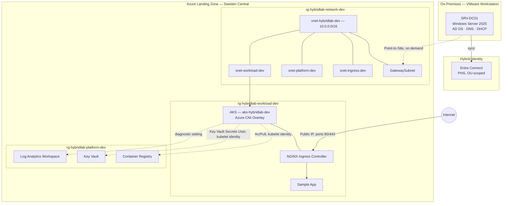

## Foundations

<a name="foundations"></a>

> 💡 Before touching real infrastructure, this phase built the Terraform skills and project conventions everything else depends on.

**Steps performed:**
- Completed a structured Terraform course — providers, state, modules, remote backends, `count`/`for_each`
- Set up the Terraform project skeleton: Azure Blob Storage remote state backend, `ARM_SUBSCRIPTION_ID` environment-variable authentication, pinned provider (`azurerm ~> 5.1.0`)
- Defined project naming conventions: app name `hybridlab`, environment `dev`, `random_string` suffixes for globally-unique resources
- Established the Terraform vs. Portal split — repeatable resources (Landing Zone, AKS, Key Vault, ACR, Log Analytics) via Terraform; wizard-heavy, one-time resources (VPN Gateway) via Portal

> 🔑 **Key insight — course material and current documentation can silently diverge.** The Terraform course used an older `azurerm` provider version than this project's pinned `~> 5.1.0`, causing attribute-name mismatches (e.g. `enable_rbac_authorization` vs. `rbac_authorization_enabled`) that only surface at `terraform plan` time — always cross-check attribute names against current provider docs, not just course notes.

⬆ [Back to top](#english)

---

## Milestone B: On-Premises Server

<a name="milestone-b-on-premises-server"></a>

> 💡 A hybrid environment needs something to be hybrid *with* — this milestone built the on-premises half: a domain controller providing identity, name resolution, and address assignment.

**Steps performed:**
- Created a Windows Server 2025 VM (4 GB RAM, 2 vCPU) in VMware Workstation, network adapter set to Bridged to avoid double-NAT ahead of Milestone C's VPN tunnel
- Assigned static IP `192.168.0.15`, excluded from the home router's DHCP pool to prevent conflicts
- Installed AD DS, promoted the server to a new forest `hybridlab.local` (NetBIOS `HYBRIDLAB`)
- Verified the DNS role (auto-installed alongside AD DS)
- Installed the DHCP role, created and authorized scope `192.168.0.100`–`192.168.0.150` — left inactive since the home router's own DHCP pool already covers most of the subnet
- Created OU `HybridLab-Staff` with a test user representing a standard employee account

| | |
|--|--|
| 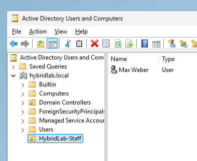 | 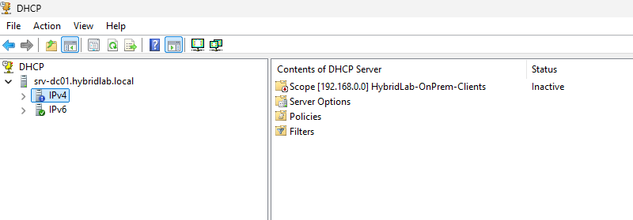 |
| *HybridLab-Staff OU and test user* | *DHCP scope — configured and authorized* |

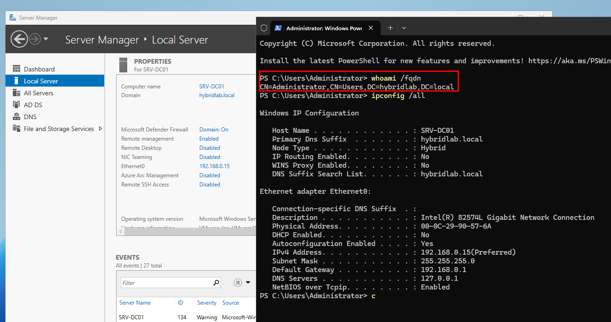

*SRV-DC01 — successfully promoted to domain controller for hybridlab.local*

> 🔑 **Key insight — promoting a server to a domain controller installs DNS automatically, but it still needs verifying.** AD DS and DNS are often treated as two separate installation steps; in practice, promoting the forest root installs and configures DNS as part of the same wizard — the role still has to be explicitly checked afterward (zones, records) rather than assumed correct.

⬆ [Back to top](#english)

---

## Milestone C: Hybrid Connectivity

<a name="milestone-c-hybrid-connectivity"></a>

> 💡 Azure VPN Gateway requires a VNet with a `GatewaySubnet` before it can exist — so this milestone's networking piece was provisioned via Terraform ahead of the full Landing Zone (Milestone E).

**Steps performed:**
- Provisioned a minimal VNet (`10.0.0.0/16`) with a `GatewaySubnet` (`10.0.255.0/27`) via Terraform
- Discovered the home ISP uses DS-Lite (no public IPv4) — pivoted from a planned Site-to-Site to a Point-to-Site VPN
- Generated a self-signed root/child certificate pair on SRV-DC01, configured certificate-based P2S authentication
- Deployed a Basic SKU VPN Gateway, verified a successful P2S connection from SRV-DC01
- Deleted the Gateway and its Public IP after verification — Gateway bills hourly regardless of usage, and no later milestone needs an active tunnel

| | |
|--|--|
| 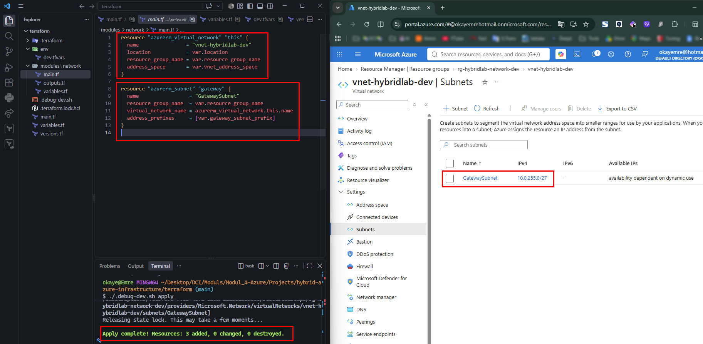 | 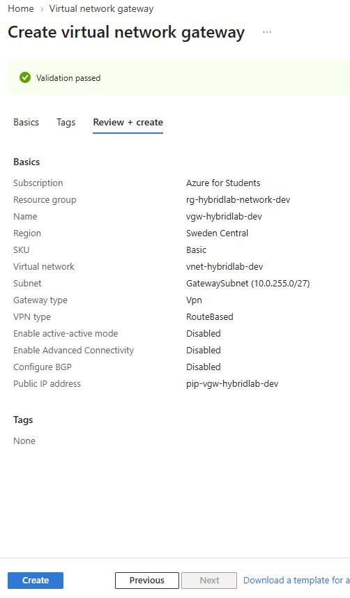 |
| *VNet + GatewaySubnet — Terraform apply* | *VPN Gateway — Portal deployment* |
| 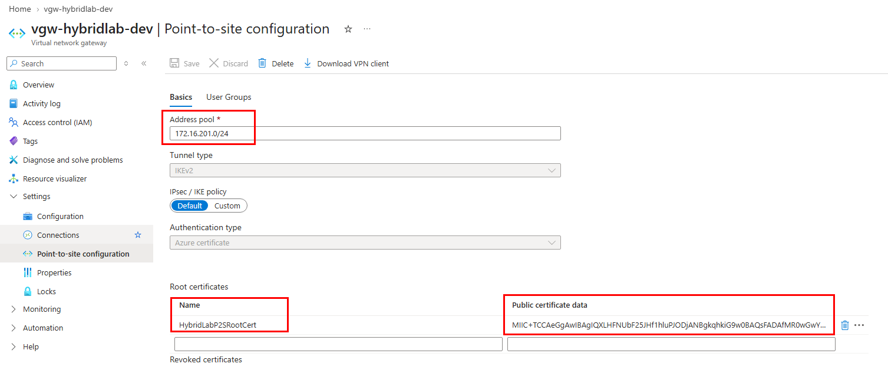 | 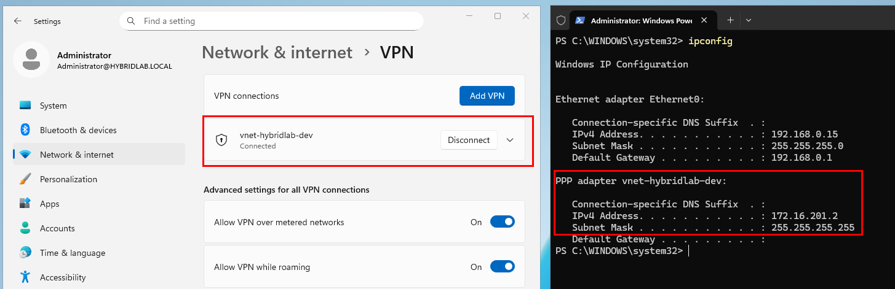 |
| *P2S client configuration* | *P2S connection — Connected* |

> 🔑 **Key insight — cloud architecture decisions can be forced by home-network reality.** Site-to-Site VPN was the original plan, but DS-Lite (no public IPv4) made it technically impossible. Point-to-Site, which initiates outbound from the server, sidesteps the problem entirely.

⬆ [Back to top](#english)

---

## Milestone D: Hybrid Identity

<a name="milestone-d-hybrid-identity"></a>

> 💡 A hybrid environment isn't really hybrid until the same person can sign in on-prem and in the cloud with one identity — this milestone built that bridge.

**Steps performed:**
- Installed Microsoft Entra Connect on SRV-DC01
- Hit an `AADSTS50020` sign-in error using the tenant's original MSA-linked owner account — created a dedicated cloud-only Global Administrator account instead
- Temporarily disabled IE Enhanced Security Configuration on SRV-DC01 to allow the wizard's embedded sign-in browser to reach `login.microsoftonline.com`
- Chose Password Hash Synchronization (PHS) over Pass-through Authentication (PTA) — no extra on-prem agent, keeps working if SRV-DC01 goes offline
- Scoped sync to only the `HybridLab-Staff` OU, excluding default/system AD objects
- Fixed a UPN suffix mismatch: added the tenant's `*.onmicrosoft.com` domain as an alternate UPN suffix in on-prem AD, updated the test user's UPN
- Ran the first sync, verified the user appeared in Microsoft Entra ID, and confirmed hybrid sign-in success

| | |
|--|--|
| 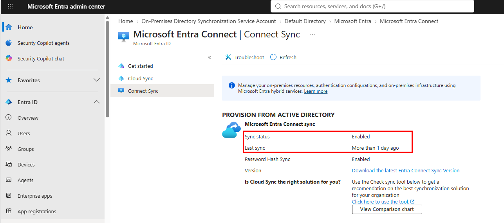 | 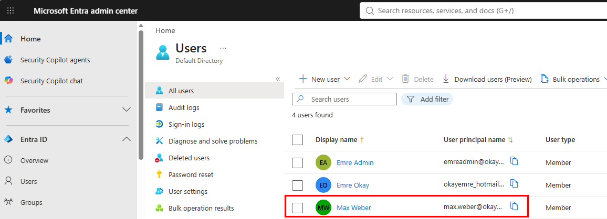 |
| *Entra Connect — sync status* | *Entra ID — synced user visible* |

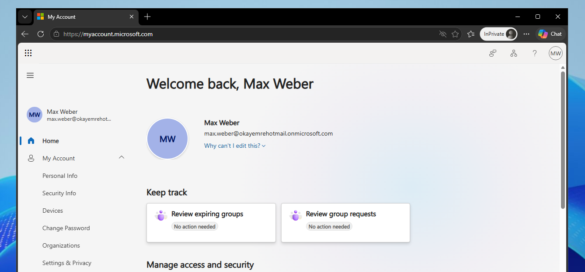

*Hybrid sign-in — same identity, on-prem and cloud*

> 🔑 **Key insight — a domain's internal name and its cloud-verifiable identity aren't automatically the same thing.** `hybridlab.local` works fine for on-prem authentication, but Entra ID silently rejects sign-in for any UPN using an unverified suffix. The fix isn't renaming the domain — it's adding a UPN alternate suffix, which only changes login names, not machine or domain names.

⬆ [Back to top](#english)

---

## Milestone E: Landing Zone

<a name="milestone-e-landing-zone"></a>

> 💡 Azure Landing Zones separate resources by function — network, workload, platform — so each layer can be rebuilt or governed independently. This milestone built that separation on top of the VNet already provisioned in Milestone C.

**Steps performed:**
- Split the Landing Zone across three resource groups: `rg-hybridlab-network-dev`, `rg-hybridlab-workload-dev`, `rg-hybridlab-platform-dev`
- Extended the existing Terraform network module with a `for_each`-based pattern, provisioning three functional subnets (ingress, platform, workload) from a single map variable
- Sized the workload subnet generously (`/20`, 4096 IPs) to accommodate an as-yet-undecided AKS network plugin (Azure CNI vs. kubenet)
- Created one Network Security Group per functional subnet, associated via `azurerm_subnet_network_security_group_association`
- Applied a shared `common_tags` local (project, environment, managed_by) across all taggable resources
- Deliberately deferred provisioning a Load Balancer / Application Gateway in the ingress subnet — no backend (AKS) exists yet to meaningfully configure or test one

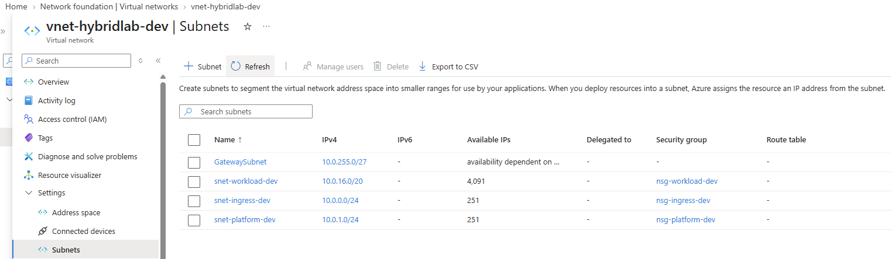

*VNet subnets — GatewaySubnet plus three functional subnets, each with its own NSG*

> 🔑 **Key insight — a `for_each` map turns a repeatable pattern into a single source of truth.** Three subnets, three NSGs, and three associations all iterate over the same `subnets` variable — adding a fourth functional subnet later means adding one map entry, not copy-pasting six resource blocks.

⬆ [Back to top](#english)

---
## Milestone F: Workload (AKS)

<a name="milestone-f-workload-aks"></a>

> 💡 With the Landing Zone in place, this milestone put an actual workload behind it — an AKS cluster, a shared ingress layer, and a sample application reachable from the internet.

**Steps performed:**
- Deployed an AKS cluster (`aks-hybridlab-dev`) through a dedicated Terraform root (`terraform-workload/`) with its own remote state, reading network outputs via `terraform_remote_state`
- Chose Azure CNI Overlay as the network plugin — pods draw IPs from a separate `10.244.0.0/16` range, avoiding kubenet's upcoming retirement and classic CNI's VNet IP consumption
- Worked through two real-world provisioning constraints: a subscription-level VM SKU restriction (settled on `Standard_D2s_v3`) and a newly-required `node_provisioning_profile` block, following Node Autoprovisioning reaching GA
- Deployed NGINX Ingress Controller via Helm (through Terraform's `helm_release` resource), giving the cluster one shared public entry point
- Deployed the sample application via plain Kubernetes YAML manifests (`kubectl apply`), deliberately outside Terraform — mirrors a realistic platform/application team split
- Diagnosed and fixed a missing NSG rule that silently blocked all internet traffic to the workload subnet
- Verified the full request path end-to-end: internet → NSG → Load Balancer → NGINX → Service → Pod

| | |
|--|--|
| 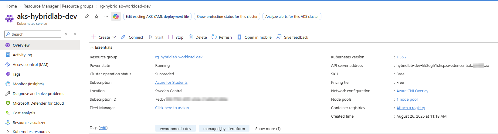 | 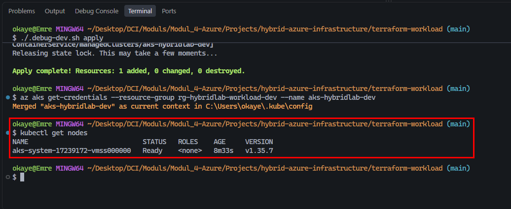 |
| *AKS cluster — Portal overview* | *Node verified via kubectl* |
| 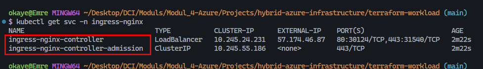 | 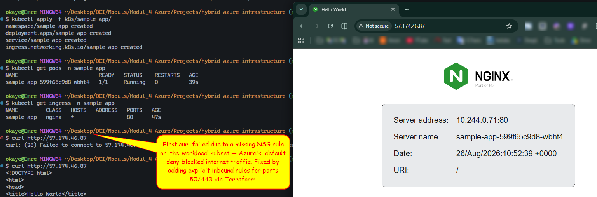 |
| *Ingress Controller — external IP assigned* | *Sample app — reachable end-to-end* |

> 🔑 **Key insight — a network layer built for "nothing yet" doesn't automatically permit something later.** Milestone E deliberately left the workload NSG empty, since there was no backend to protect at the time. Once a real internet-facing service existed, Azure's default-deny rule silently dropped every request (a timeout, not a refusal) until an explicit allow rule was added — a reminder that "empty" infrastructure decisions need revisiting once their preconditions change.

⬆ [Back to top](#english)

---
## Milestone G: Platform Services

<a name="milestone-g-platform-services"></a>

> 💡 With AKS running a real workload, this milestone filled in the platform-services layer the Landing Zone had reserved space for since Milestone E — secrets management, a private image registry, and centralized logging.

**Steps performed:**
- Restructured Terraform into three roots grouped under a single `terraform/` parent — `terraform-network/`, `terraform-workload/`, `terraform-platform/` — extending the existing `terraform_remote_state` pattern to a third, independent layer
- Provisioned Key Vault (RBAC authorization), Container Registry (Basic SKU), and a Log Analytics Workspace in `rg-hybridlab-platform-dev`
- Granted the AKS kubelet identity `AcrPull` on the registry and `Key Vault Secrets User` on the vault — no stored credentials on either path
- Forwarded AKS control-plane logs and metrics to Log Analytics via a diagnostic setting
- Verified ACR access by importing a public image (`az acr import`) and confirming the sample app pulled it using only the kubelet identity
- Enabled the Key Vault Secrets Store CSI driver add-on and mounted a demo secret into a pod, confirming the identity chain end-to-end
- Reverted the sample app to its Milestone F state afterward — the ACR/Key Vault wiring was a one-time functional test, not a permanent change to the demo app

| | |
|--|--|
| 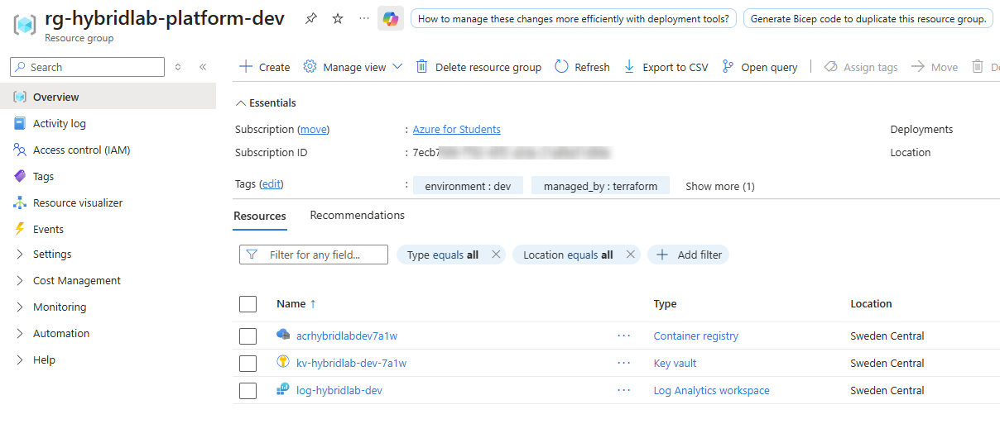 | 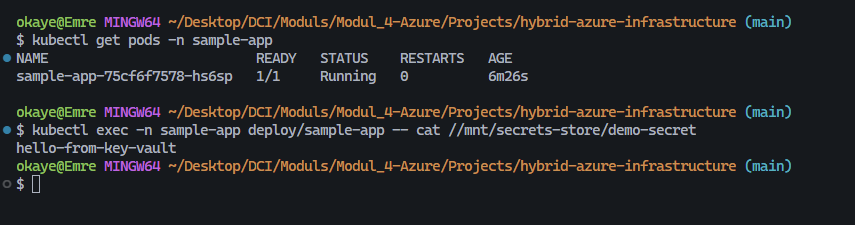 |
| *Platform services — Portal overview* | *Key Vault secret — mounted and read from inside a pod* |

> 🔑 **Key insight — a managed identity's own auto-created "helper" identity isn't automatically usable the way you'd expect.** Enabling the Key Vault CSI driver add-on creates a dedicated identity for it, but that identity defaulted to a Workload Identity (federated/OIDC) token flow with no federation configured — a `401`/`AADSTS70025` error that had nothing to do with any role assignment. Switching the `SecretProviderClass` to explicit VM Managed Identity mode, using the cluster's existing kubelet identity, resolved it without any extra federation setup.

⬆ [Back to top](#english)

---

## Milestone H: Monitoring

<a name="milestone-h-monitoring"></a>

> 💡 With Container Insights now live on the AKS cluster, this milestone added the observability layer the Landing Zone had left implicit since Milestone F — resource metrics, alerting, and a queryable operational view, built on the Log Analytics workspace from Milestone G.

**Steps performed:**
- Enabled Container Insights on the AKS cluster via the `oms_agent` block (MSI-based auth, no stored credentials)
- Manually provisioned a Data Collection Endpoint, Data Collection Rule (`ContainerInsights` extension), and DCR-to-cluster association — the piece Terraform's `oms_agent` resource doesn't create automatically
- Added an Action Group with an email receiver as the shared alert notification target
- Created a platform metric alert on node CPU usage (>80% over 5 minutes), independent of the Container Insights pipeline
- Created a Log Analytics scheduled query alert firing on `CrashLoopBackOff` / `ImagePullBackOff` / `ErrImagePull` pod states
- Built an Azure Workbook summarizing pod status distribution and node status from the Log Analytics workspace

| | | |
|--|--|--|
| 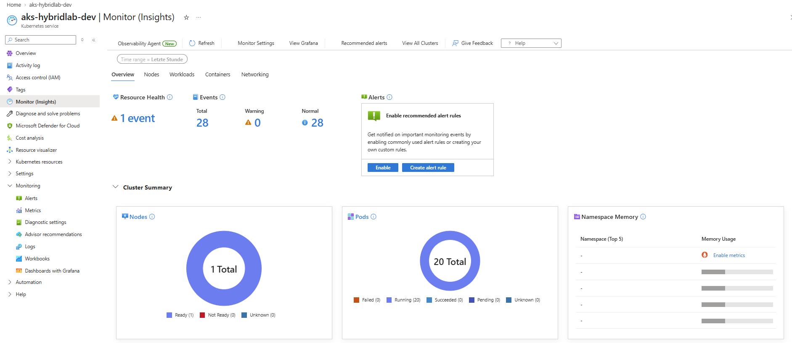 | 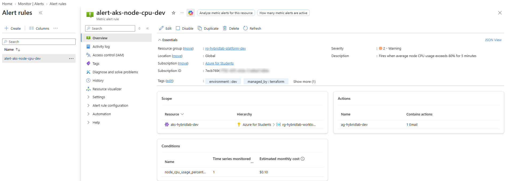 | 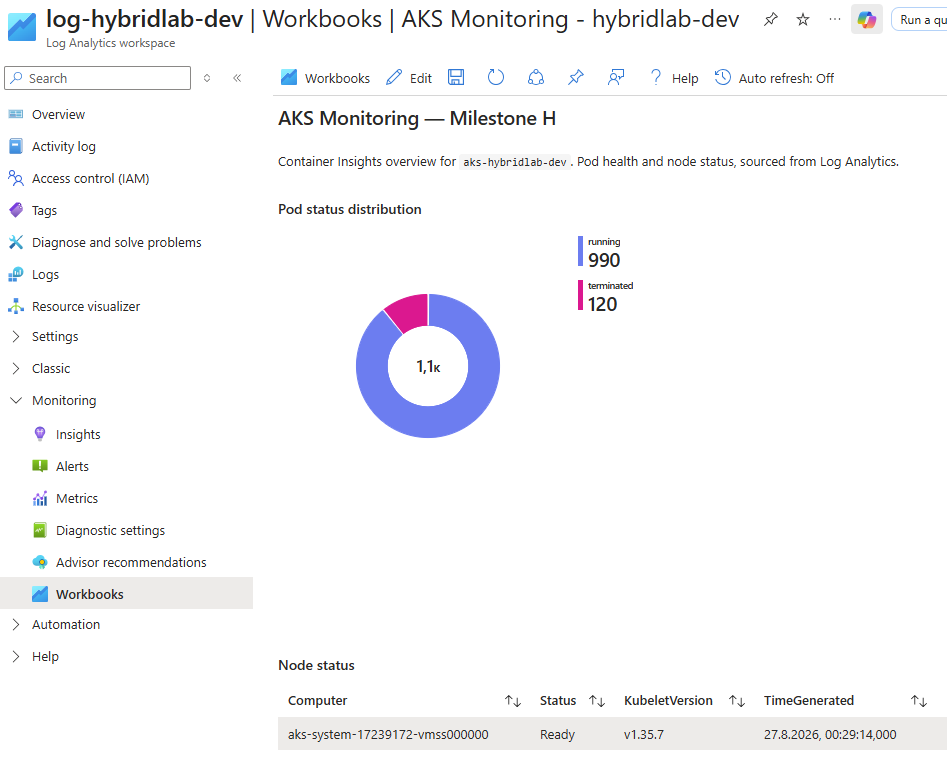 |
| *Container Insights — cluster overview* | *Metric alert — node CPU rule* | *Workbook — pod & node status* |

> 🔑 **Key insight — enabling an agent isn't the same as onboarding it.** Terraform's `oms_agent` block deploys the Container Insights agent pods onto every node, but unlike the `az aks enable-addons monitoring` CLI path, it does not create the Data Collection Endpoint, Data Collection Rule, or their association with the cluster. Without those three resources, the agent runs but has nowhere to send data — no error, just a silent "Not collecting" status until the missing pipeline is added explicitly.

⬆ [Back to top](#english)

---

## Roadmap

## Roadmap

- **Milestone I — Backup:** Recovery strategy for on-prem VM and Azure resources
- **Milestone J — Policy:** Azure Policy enforcement test and documentation
- **Milestone K — Budget & Extensions (optional):** Budget alerts, plus CI/CD pipeline and failure simulation as stretch goals

⬆ [Back to top](#english)

---

<a name="deutsch"></a>
# Deutsch

Ein praxisnahes, selbst umgesetztes Projekt: eine hybride IT-Infrastruktur, bestehend aus einem On-Premises-Windows-Server, der über einen sicheren Netzwerktunnel und eine gemeinsame Identitätsebene mit Microsoft Azure verbunden ist. Als vierwöchiges Abschlussprojekt allein umgesetzt, mit Terraform als Infrastructure-as-Code-Schicht für jede wiederholbare Azure-Ressource.

> 📄 **Originalaufgabenstellung:** [docs/Abschlussprojekt_Hybrid_Infrastruktur.pdf](docs/Abschlussprojekt_Hybrid_Infrastruktur.pdf)

## Der Ansatz

Die wenigsten Unternehmen sind rein "Cloud" oder rein "On-Premises" — bestehende Systeme lassen sich nicht über Nacht verschieben, manche Daten müssen lokal bleiben, Migrationen passieren schrittweise. Dieses Projekt bildet genau das im Kleinen nach: eine On-Premises-Active-Directory-Umgebung, die weiterläuft, eine Azure-Workload, die dieselben Identitäten braucht, und ein sicherer Tunnel, der beide verbindet — dazu die Betriebsebene (Monitoring, Backup, Policy, Budget), die eine echte Umgebung drumherum bräuchte.

## 📋 Inhaltsverzeichnis

| | Milestone | Thema | Status |
|--|-----------|-------|--------|
| 🧱 | [Grundlagen](#grundlagen) | Terraform-Basiswissen, Namenskonvention, Projekt-Setup | ✅ |
| 🖥️ | [Milestone B: On-Premises-Server](#milestone-b-on-premises-server-de) | AD DS, DNS, DHCP, OU-Struktur | ✅ |
| 🔌 | [Milestone C: Hybrid-Konnektivität](#milestone-c-hybrid-konnektivitat) | VNet, GatewaySubnet, Point-to-Site-VPN | ✅ |
| 🔐 | [Milestone D: Hybrid-Identität](#milestone-d-hybrid-identitat) | Entra Connect, PHS, UPN-Suffix | ✅ |
| 🏗️ | [Milestone E: Landing Zone](#milestone-e-landing-zone-de) | Resource Groups, VNet-Subnetze, NSGs | ✅ |
| ☸️ | [Milestone F: Workload (AKS)](#milestone-f-workload-aks-de) | AKS, NGINX Ingress, Beispiel-App | ✅ |
| 🔑 | [Milestone G: Plattform-Dienste](#milestone-g-plattform-dienste-de) | Key Vault, ACR, Log Analytics | ✅ |
| 📊 | [Milestone H: Monitoring](#milestone-h-monitoring-de) | Container Insights, Alerts, Workbook | ✅ |
| 💾 | Milestone I–K: Governance & Erweiterungen | Backup, Policy, Budget | ⏳ |

## 🏗️ Infrastruktur-Übersicht

| Ressource | Name | Konfiguration |
|---|---|---|
| Domain Controller | SRV-DC01 | Windows Server 2025, VMware Workstation, statische IP 192.168.0.15 |
| AD-Forest / Domäne | hybridlab.local | NetBIOS `HYBRIDLAB`, OU `HybridLab-Staff` |
| Hybrid-Identitätssynchronisation | Microsoft Entra Connect | Password Hash Sync, OU-eingeschränkt |
| Resource Group (Network) | `rg-hybridlab-network-dev` | Sweden Central |
| Resource Group (Workload) | `rg-hybridlab-workload-dev` | Sweden Central — AKS-Cluster bereitgestellt |
| AKS-Cluster | `aks-hybridlab-dev` | Azure CNI Overlay, 1× `Standard_D2s_v3`-Node, manuelles Node Provisioning |
| Ingress | NGINX Ingress Controller | Per Helm bereitgestellt, ein gemeinsamer öffentlicher IP |
| Terraform-State (Workload) | `terraform-workload/` | Eigener State (`workload-dev.tfstate`), liest Netzwerk-Outputs via `terraform_remote_state` |
| Resource Group (Platform) | `rg-hybridlab-platform-dev` | Sweden Central, leer — Milestone G ausstehend |
| Virtual Network | `vnet-hybridlab-dev` | `10.0.0.0/16` |
| Subnetze | GatewaySubnet · snet-ingress-dev · snet-platform-dev · snet-workload-dev | `10.0.255.0/27` · `10.0.0.0/24` · `10.0.1.0/24` · `10.0.16.0/20` |
| Network Security Groups | nsg-ingress-dev · nsg-platform-dev · nsg-workload-dev | Je 1:1 mit funktionalem Subnetz |
| Resource Group (Platform) | `rg-hybridlab-platform-dev` | Sweden Central — Key Vault, ACR, Log Analytics bereitgestellt |
| Key Vault | `kv-hybridlab-dev-<suffix>` | RBAC-Autorisierung, öffentlicher Netzwerkzugriff |
| Container Registry | `acrhybridlabdev<suffix>` | Basic SKU, Zugriff per Managed Identity (keine Admin-Zugangsdaten) |
| Log Analytics Workspace | `log-hybridlab-dev` | PerGB2018, 30 Tage Aufbewahrung — empfängt AKS-Diagnosedaten |
| Terraform-State (Platform) | `terraform/terraform-platform/` | Eigener State (`platform-dev.tfstate`), liest Network- + Workload-Outputs |
| Container Insights | `oms_agent` auf AKS | MSI-basierte Auth, Data Collection Rule + Endpoint an Log Analytics angebunden |
| Monitor Action Group | `ag-hybridlab-dev` | E-Mail-Empfänger, gemeinsames Ziel für beide Alert-Regeln |
| Alerts | `alert-aks-node-cpu-dev` · `alert-aks-pod-failures-dev` | Platform-Metric-Alert (Node-CPU) + Log-Analytics-Scheduled-Query-Alert (Pod-Fehler) |
| Workbook | AKS Monitoring - hybridlab-dev | Pod-Statusverteilung, Node-Status — aus Log Analytics |

> Das Architekturdiagramm im englischen Abschnitt oben gilt sprachübergreifend — Azure-Ressourcennamen bleiben ohnehin auf Englisch.

## Grundlagen

<a name="grundlagen"></a>

> 💡 Bevor echte Infrastruktur angefasst wurde, baute diese Phase das Terraform-Wissen und die Projektkonventionen auf, von denen alles Weitere abhängt.

**Durchgeführte Schritte:**
- Strukturierten Terraform-Kurs abgeschlossen — Provider, State, Module, Remote Backends, `count`/`for_each`
- Terraform-Projektgerüst aufgesetzt: Remote-State-Backend in Azure Blob Storage, Authentifizierung über `ARM_SUBSCRIPTION_ID`-Umgebungsvariable, fixierte Provider-Version (`azurerm ~> 5.1.0`)
- Namenskonvention festgelegt: App-Name `hybridlab`, Umgebung `dev`, `random_string`-Suffixe für global eindeutige Ressourcen
- Terraform-vs.-Portal-Aufteilung definiert — wiederholbare Ressourcen (Landing Zone, AKS, Key Vault, ACR, Log Analytics) über Terraform; einmalige, assistentenlastige Ressourcen (VPN Gateway) über das Portal

> 🔑 **Erkenntnis — Kursmaterial und aktuelle Dokumentation können auseinanderlaufen.** Der Terraform-Kurs nutzte eine ältere `azurerm`-Provider-Version als die im Projekt fixierte `~> 5.1.0`, was zu abweichenden Attributnamen führte (z. B. `enable_rbac_authorization` vs. `rbac_authorization_enabled`) — sichtbar erst bei `terraform plan`. Attributnamen daher immer gegen die aktuelle Provider-Dokumentation prüfen, nicht nur gegen Kursnotizen.

⬆ [Nach oben](#deutsch)

---

## Milestone B: On-Premises-Server

<a name="milestone-b-on-premises-server-de"></a>

> 💡 Eine hybride Umgebung braucht eine Gegenseite, mit der sie hybrid sein kann — dieser Milestone baute die On-Premises-Hälfte: einen Domain Controller für Identität, Namensauflösung und Adressvergabe.

**Durchgeführte Schritte:**
- Windows-Server-2025-VM erstellt (4 GB RAM, 2 vCPU) in VMware Workstation, Netzwerkadapter auf Bridged gestellt, um Double-NAT vor dem VPN-Tunnel in Milestone C zu vermeiden
- Statische IP `192.168.0.15` vergeben, aus dem DHCP-Pool des Heimrouters ausgeschlossen, um Konflikte zu vermeiden
- AD DS installiert, Server zu neuem Forest `hybridlab.local` (NetBIOS `HYBRIDLAB`) heraufgestuft
- DNS-Rolle verifiziert (wird bei AD DS automatisch mitinstalliert)
- DHCP-Rolle installiert, Scope `192.168.0.100`–`192.168.0.150` angelegt und autorisiert — inaktiv belassen, da der Heimrouter bereits den Großteil des Subnetzes per DHCP abdeckt
- OU `HybridLab-Staff` mit einem Testbenutzer angelegt, der einen typischen Mitarbeiter-Account repräsentiert

| | |
|--|--|
|  |  |
| *HybridLab-Staff-OU und Testbenutzer* | *DHCP-Scope — konfiguriert und autorisiert* |


*SRV-DC01 — erfolgreich zum Domain Controller für hybridlab.local heraufgestuft*

> 🔑 **Erkenntnis — die Heraufstufung zum Domain Controller installiert DNS automatisch, muss aber trotzdem geprüft werden.** AD DS und DNS wirken wie zwei getrennte Installationsschritte; tatsächlich installiert und konfiguriert der Assistent DNS direkt mit — die Rolle muss danach trotzdem explizit verifiziert werden (Zonen, Einträge), statt als korrekt vorausgesetzt zu werden.

⬆ [Nach oben](#deutsch)

---

## Milestone C: Hybrid-Konnektivität

<a name="milestone-c-hybrid-konnektivitat"></a>

> 💡 Ein Azure VPN Gateway benötigt zwingend ein VNet mit einem `GatewaySubnet`, bevor es existieren kann — der Netzwerkanteil dieses Milestones wurde deshalb per Terraform vorgezogen, noch vor der vollständigen Landing Zone (Milestone E).

**Durchgeführte Schritte:**
- Minimales VNet (`10.0.0.0/16`) mit `GatewaySubnet` (`10.0.255.0/27`) per Terraform bereitgestellt
- Festgestellt, dass der heimische Internetanbieter DS-Lite nutzt (keine öffentliche IPv4) — Wechsel vom geplanten Site-to-Site zu Point-to-Site-VPN
- Selbstsigniertes Root-/Child-Zertifikatspaar auf SRV-DC01 erzeugt, zertifikatsbasierte P2S-Authentifizierung konfiguriert
- VPN Gateway der Basic-SKU bereitgestellt, erfolgreiche P2S-Verbindung von SRV-DC01 verifiziert
- Gateway und zugehörige Public IP nach der Verifikation gelöscht — das Gateway wird stundenweise abgerechnet, unabhängig von der Nutzung, und kein späterer Milestone benötigt einen aktiven Tunnel

| | |
|--|--|
|  |  |
| *VNet + GatewaySubnet — Terraform Apply* | *VPN Gateway — Bereitstellung im Portal* |
|  |  |
| *P2S-Client-Konfiguration* | *P2S-Verbindung — Verbunden* |

> 🔑 **Erkenntnis — Cloud-Architekturentscheidungen können durch die Realität des Heimnetzwerks erzwungen werden.** Site-to-Site-VPN war der ursprüngliche Plan, aber DS-Lite (keine öffentliche IPv4) machte ihn technisch unmöglich. Point-to-Site, das den Verbindungsaufbau vom Server aus initiiert, umgeht das Problem vollständig.

⬆ [Nach oben](#deutsch)

---

## Milestone D: Hybrid-Identität

<a name="milestone-d-hybrid-identitat"></a>

> 💡 Eine hybride Umgebung ist erst wirklich hybrid, wenn sich dieselbe Person on-premises und in der Cloud mit einer Identität anmelden kann — dieser Milestone baute genau diese Brücke.

**Durchgeführte Schritte:**
- Microsoft Entra Connect auf SRV-DC01 installiert
- Anmeldefehler `AADSTS50020` mit dem ursprünglichen, MSA-verknüpften Tenant-Owner-Account erhalten — stattdessen einen dedizierten Cloud-only-Global-Administrator-Account angelegt
- IE Enhanced Security Configuration auf SRV-DC01 temporär deaktiviert, damit der eingebettete Anmelde-Browser des Assistenten `login.microsoftonline.com` erreichen konnte
- Password Hash Synchronization (PHS) statt Pass-through Authentication (PTA) gewählt — kein zusätzlicher On-Premises-Agent nötig, funktioniert weiter, falls SRV-DC01 offline geht
- Synchronisation auf die OU `HybridLab-Staff` beschränkt, Standard-/System-AD-Objekte ausgeschlossen
- UPN-Suffix-Konflikt behoben: `*.onmicrosoft.com`-Domäne des Tenants als alternatives UPN-Suffix im On-Premises-AD hinzugefügt, UPN des Testbenutzers entsprechend aktualisiert
- Erste Synchronisation ausgeführt, Benutzer in Microsoft Entra ID verifiziert, erfolgreiche hybride Anmeldung bestätigt

| | |
|--|--|
|  |  |
| *Entra Connect — Synchronisationsstatus* | *Entra ID — synchronisierter Benutzer sichtbar* |


*Hybride Anmeldung — dieselbe Identität, on-premises und in der Cloud*

> 🔑 **Erkenntnis — der interne Name einer Domäne und ihre cloud-verifizierbare Identität sind nicht automatisch dasselbe.** `hybridlab.local` funktioniert einwandfrei für die On-Premises-Authentifizierung, aber Entra ID lehnt die Anmeldung für jedes UPN mit einem nicht verifizierten Suffix stillschweigend ab. Die Lösung ist nicht die Umbenennung der Domäne — sondern ein alternatives UPN-Suffix, das ausschließlich den Anmeldenamen ändert, nicht den Rechner- oder Domänennamen.

⬆ [Nach oben](#deutsch)

---

## Milestone E: Landing Zone

<a name="milestone-e-landing-zone-de"></a>

> 💡 Azure Landing Zones trennen Ressourcen nach Funktion — Network, Workload, Platform —, damit jede Schicht unabhängig neu aufgebaut oder verwaltet werden kann. Dieser Milestone baute diese Trennung auf dem bereits in Milestone C bereitgestellten VNet auf.

**Durchgeführte Schritte:**
- Landing Zone auf drei Resource Groups aufgeteilt: `rg-hybridlab-network-dev`, `rg-hybridlab-workload-dev`, `rg-hybridlab-platform-dev`
- Bestehendes Terraform-Netzwerkmodul um ein `for_each`-basiertes Muster erweitert, das drei funktionale Subnetze (Ingress, Platform, Workload) aus einer einzigen Map-Variable erzeugt
- Workload-Subnetz großzügig dimensioniert (`/20`, 4096 IPs), um ein noch nicht festgelegtes AKS-Netzwerk-Plugin (Azure CNI vs. kubenet) zu berücksichtigen
- Pro funktionalem Subnetz eine eigene Network Security Group erstellt, verknüpft über `azurerm_subnet_network_security_group_association`
- Gemeinsames `common_tags`-Local (Project, Environment, Managed_by) auf alle taggbaren Ressourcen angewendet
- Bereitstellung eines Load Balancers/Application Gateways im Ingress-Subnetz bewusst zurückgestellt — es existiert noch kein Backend (AKS), um eine solche Ressource sinnvoll zu konfigurieren oder zu testen


*VNet-Subnetze — GatewaySubnet plus drei funktionale Subnetze, jeweils mit eigener NSG*

> 🔑 **Erkenntnis — eine `for_each`-Map macht aus einem sich wiederholenden Muster eine einzige Quelle der Wahrheit.** Drei Subnetze, drei NSGs und drei Assoziationen iterieren alle über dieselbe `subnets`-Variable — ein viertes funktionales Subnetz später hinzuzufügen bedeutet einen zusätzlichen Map-Eintrag, kein Copy-Paste von sechs Resource-Blöcken.

⬆ [Nach oben](#deutsch)

---
## Milestone F: Workload (AKS)

<a name="milestone-f-workload-aks-de"></a>

> 💡 Mit der Landing Zone an Ort und Stelle brachte dieser Milestone eine echte Workload dahinter — einen AKS-Cluster, eine gemeinsame Ingress-Schicht und eine aus dem Internet erreichbare Beispielanwendung.

**Durchgeführte Schritte:**
- AKS-Cluster (`aks-hybridlab-dev`) über eine eigene Terraform-Root (`terraform-workload/`) mit eigenem Remote State bereitgestellt, Netzwerk-Outputs per `terraform_remote_state` eingelesen
- Azure CNI Overlay als Netzwerk-Plugin gewählt — Pods beziehen IPs aus einem separaten `10.244.0.0/16`-Bereich, umgeht die bevorstehende Kubenet-Abschaltung und den VNet-IP-Verbrauch des klassischen CNI
- Zwei reale Einschränkungen bei der Bereitstellung gelöst: eine Subscription-seitige VM-SKU-Beschränkung (Lösung: `Standard_D2s_v3`) und einen neu verpflichtenden `node_provisioning_profile`-Block, nachdem Node Autoprovisioning GA wurde
- NGINX Ingress Controller per Helm bereitgestellt (über Terraforms `helm_release`-Ressource) — ein einzelner, gemeinsamer öffentlicher Einstiegspunkt für den Cluster
- Beispielanwendung über reine Kubernetes-YAML-Manifeste bereitgestellt (`kubectl apply`), bewusst außerhalb von Terraform — spiegelt eine realistische Trennung zwischen Plattform- und Anwendungsteam
- Eine fehlende NSG-Regel diagnostiziert und behoben, die sämtlichen Internet-Traffic zum Workload-Subnetz stillschweigend blockierte
- Den gesamten Anfrageweg Ende-zu-Ende verifiziert: Internet → NSG → Load Balancer → NGINX → Service → Pod

| | |
|--|--|
|  |  |
| *AKS-Cluster — Portal-Übersicht* | *Node per kubectl verifiziert* |
|  |  |
| *Ingress Controller — externe IP zugewiesen* | *Beispiel-App — Ende-zu-Ende erreichbar* |

> 🔑 **Erkenntnis — eine Netzwerkebene, die für "noch nichts" gebaut wurde, erlaubt nicht automatisch "etwas" später.** Milestone E ließ die Workload-NSG bewusst leer, da es zu dem Zeitpunkt noch kein zu schützendes Backend gab. Sobald ein echter, internetseitig erreichbarer Dienst existierte, verwarf Azures Standard-Deny-Regel jede Anfrage stillschweigend (ein Timeout, keine Ablehnung) — bis eine explizite Allow-Regel ergänzt wurde. Eine Erinnerung, dass "leere" Infrastrukturentscheidungen überprüft werden müssen, sobald sich ihre Voraussetzungen ändern.

⬆ [Nach oben](#deutsch)

---
## Milestone G: Plattform-Dienste

<a name="milestone-g-plattform-dienste-de"></a>

> 💡 Mit einer echten Workload auf AKS füllte dieser Milestone die Plattform-Dienste-Schicht, für die seit Milestone E bereits Platz reserviert war — Secret-Verwaltung, eine private Image-Registry und zentrales Logging.

**Durchgeführte Schritte:**
- Terraform in drei Roots unter einem gemeinsamen `terraform/`-Elternordner umstrukturiert — `terraform-network/`, `terraform-workload/`, `terraform-platform/` — bestehendes `terraform_remote_state`-Muster auf eine dritte, unabhängige Schicht erweitert
- Key Vault (RBAC-Autorisierung), Container Registry (Basic SKU) und einen Log Analytics Workspace in `rg-hybridlab-platform-dev` bereitgestellt
- AKS-Kubelet-Identity `AcrPull` auf der Registry und `Key Vault Secrets User` auf dem Vault zugewiesen — auf beiden Wegen keine gespeicherten Zugangsdaten
- AKS-Control-Plane-Logs und -Metriken per Diagnostic Setting an Log Analytics weitergeleitet
- ACR-Zugriff verifiziert durch Import eines öffentlichen Images (`az acr import`) und Bestätigung, dass die Beispiel-App es allein über die Kubelet-Identity zog
- Key-Vault-CSI-Driver-Add-on aktiviert und ein Demo-Secret in einen Pod gemountet, Identitätskette Ende-zu-Ende bestätigt
- Beispiel-App danach auf den Milestone-F-Stand zurückgesetzt — die ACR-/Key-Vault-Anbindung war ein einmaliger Funktionstest, keine dauerhafte Änderung an der Demo-App

| | |
|--|--|
|  |  |
| *Plattform-Dienste — Portal-Übersicht* | *Key-Vault-Secret — gemountet und aus einem Pod ausgelesen* |

> 🔑 **Erkenntnis — die automatisch erzeugte "Hilfs-Identity" einer Managed Identity ist nicht automatisch so nutzbar wie erwartet.** Das Aktivieren des Key-Vault-CSI-Driver-Add-ons erzeugt eine eigene Identity dafür, die aber standardmäßig einen Workload-Identity-(federated/OIDC-)Token-Flow ohne konfigurierte Föderation nutzte — ein `401`/`AADSTS70025`-Fehler, der nichts mit einer Rollenzuweisung zu tun hatte. Das Umstellen der `SecretProviderClass` auf expliziten VM-Managed-Identity-Modus, unter Nutzung der bereits vorhandenen Kubelet-Identity des Clusters, löste das Problem ohne zusätzliche Föderationskonfiguration.

⬆ [Nach oben](#deutsch)

---

## Milestone H: Monitoring

<a name="milestone-h-monitoring-de"></a>

> 💡 Mit aktiviertem Container Insights auf dem AKS-Cluster ergänzte dieser Meilenstein die Beobachtbarkeits-Ebene, die seit Milestone F implizit blieb — Ressourcenmetriken, Alerting und eine abfragbare Betriebssicht, aufbauend auf dem Log-Analytics-Workspace aus Milestone G.

**Durchgeführte Schritte:**
- Container Insights auf dem AKS-Cluster über den `oms_agent`-Block aktiviert (MSI-basierte Authentifizierung, keine gespeicherten Zugangsdaten)
- Data Collection Endpoint, Data Collection Rule (`ContainerInsights`-Extension) und DCR-Cluster-Verknüpfung manuell bereitgestellt — der Teil, den Terraforms `oms_agent`-Ressource nicht automatisch erstellt
- Action Group mit E-Mail-Empfänger als gemeinsames Alert-Ziel hinzugefügt
- Platform-Metric-Alert für Node-CPU-Auslastung erstellt (>80 % über 5 Minuten), unabhängig von der Container-Insights-Pipeline
- Log-Analytics-Scheduled-Query-Alert erstellt, der bei `CrashLoopBackOff` / `ImagePullBackOff` / `ErrImagePull` auslöst
- Azure Workbook mit Pod-Status-Verteilung und Node-Status aus dem Log-Analytics-Workspace erstellt

| | | |
|--|--|--|
|  |  |  |
| *Container Insights — Cluster-Übersicht* | *Metric Alert — Node-CPU-Regel* | *Workbook — Pod- & Node-Status* |

> 🔑 **Erkenntnis — einen Agenten zu aktivieren heißt nicht, ihn ans System anzubinden.** Der `oms_agent`-Block installiert die Container-Insights-Agent-Pods auf jedem Node, erstellt aber — anders als der CLI-Pfad `az aks enable-addons monitoring` — weder Data Collection Endpoint noch Data Collection Rule noch deren Verknüpfung mit dem Cluster. Ohne diese drei Ressourcen läuft der Agent, hat aber kein Ziel für seine Daten — kein Fehler, nur ein stiller "Not collecting"-Status, bis die fehlende Pipeline explizit ergänzt wird.

⬆ [Nach oben](#deutsch)

---
## Roadmap

- **Milestone I — Backup:** Recovery-Strategie für On-Prem-VM und Azure-Ressourcen
- **Milestone J — Policy:** Test und Dokumentation einer Azure-Policy-Durchsetzung
- **Milestone K — Budget & Erweiterungen (optional):** Budget-Alerts sowie CI/CD-Pipeline und Ausfallsimulation als optionale Erweiterungsziele

⬆ [Nach oben](#deutsch)

---

## 🧠 Wichtigste Erkenntnisse

| # | Erkenntnis | Warum es wichtig ist |
|---|---------|-----------------|
| 1 | 🧱 Provider-Versionsabweichungen führen zu stillen Konflikten | Kursmaterial vs. fixierte `azurerm ~> 5.1.0` — immer gegen aktuelle Doku prüfen |
| 2 | 🖥️ AD-DS-Heraufstufung installiert DNS automatisch mit | Trotzdem explizite Verifikation nach der Installation nötig |
| 3 | 🔌 Die Realität des Heimnetzwerks kann den Lehrbuch-Plan überstimmen | DS-Lite erzwang den Wechsel von Site-to-Site zu Point-to-Site |
| 4 | 🔐 Domänenname ≠ cloud-verifizierbare Identität | Alternatives UPN-Suffix behebt die Anmeldung, ohne die Domäne umzubenennen |
| 5 | 🏗️ `for_each` macht aus Wiederholung eine einzige Quelle der Wahrheit | Eine Map-Variable steuert Subnetze, NSGs und Assoziationen gemeinsam |
| 6 | ☸️ Ein Netzwerk-Plugin ist eine permanente Entscheidung | Azure CNI Overlay musste vor dem Cluster-Bau feststehen — Änderung erfordert Neuerstellung |
| 7 | 🔐 Standard-Deny gilt auch für noch ungenutzte Subnetze | Eine leere NSG blockiert stillschweigend, sobald ein echter Dienst dahinter erscheint |
| 8 | 🔐 Subscription-Rollen ≠ Key-Vault-Datenebenen-Zugriff | RBAC-aktivierte Key Vaults brauchen eine eigene Datenebenen-Rolle (z. B. Secrets Officer), unabhängig von Owner/Contributor |
| 9 | 🔑 Eine Add-on-eigene Identity ist nicht automatisch die richtige | CSI-Driver-Add-on-Identity nutzte standardmäßig Workload-Identity-Föderation — VM Managed Identity (Kubelet) war der einfachere, funktionierende Pfad |
| 10 | 📊 Ein Agent zu aktivieren heißt nicht, ihn zu onboarden | `oms_agent` installiert die Agent-Pods, aber DCE/DCR/Association müssen bei Terraform-Deployments manuell ergänzt werden |
| 11 | 🔔 Zwei Alert-Typen decken zwei Fehlerebenen ab | Platform-Metric-Alerts sind unabhängig von der Log-Pipeline; Log-based Alerts benötigen die volle Container-Insights-Kette |

## 🛠️ Tools & Services


## 📁 Repository-Struktur

```
hybrid-azure-infrastructure/
├── README.md
├── project-decisions.md
├── docs/
│   └── Abschlussprojekt_Hybrid_Infrastruktur.pdf
├── screenshots/
│
├── k8s/
│   └── sample-app/
│       ├── 00-namespace.yaml
│       ├── 01-deployment.yaml
│       ├── 02-service.yaml
│       ├── 03-ingress.yaml
│       └── 04-secretproviderclass.yaml
└── terraform/
    ├── terraform-network/
    │   ├── main.tf
    │   ├── variables.tf
    │   ├── outputs.tf
    │   ├── versions.tf
    │   ├── env/
    │   │   └── dev.tfvars
    │   └── modules/
    │       └── network/
    │           ├── main.tf
    │           ├── variables.tf
    │           └── outputs.tf
    ├── terraform-workload/
    │   ├── main.tf
    │   ├── variables.tf
    │   ├── outputs.tf
    │   ├── versions.tf
    │   ├── env/
    │   │   └── dev.tfvars
    │   └── modules/
    │       └── aks/
    │           ├── main.tf
    │           ├── variables.tf
    │           └── outputs.tf
    └── terraform-platform/
        ├── main.tf
        ├── variables.tf
        ├── outputs.tf
        ├── versions.tf
        ├── env/
        │   └── dev.tfvars
        └── modules/
            ├── keyvault/
            │   ├── main.tf
            │   ├── variables.tf
            │   └── outputs.tf
            ├── acr/
            │   ├── main.tf
            │   ├── variables.tf
            │   └── outputs.tf
            └── log_analytics/
                ├── main.tf
                ├── variables.tf
                └── outputs.tf
```

---

> *DCI Weiterbildung – IT System Administrator & Cloud Engineer · Sweden Central · Azure for Students Subscription · August 2026*
